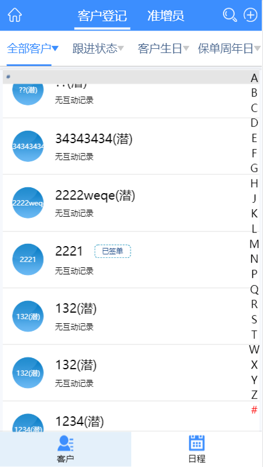
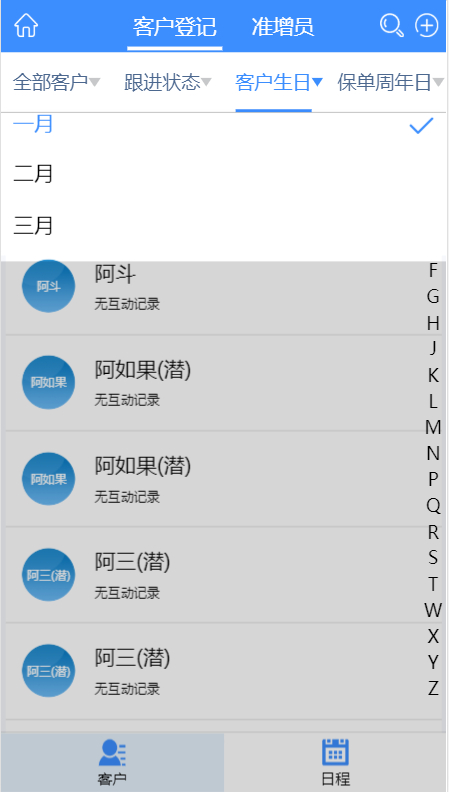

# 客户管理

> A Vue.js

# 项目说明

> 客户管理项目采用vue.js框架，vue-rouer进行项目管理，vuex进行数据状态管理，用fastClick处理移动端点击延迟，vue-lazyload处理图片懒加载，axios进行前后台交互，对axios的请求拦截进行过渡动画处理，better-scroll插件进行滚动处理。

> 页面右侧采用点击或滑动定位客户姓名

# 项目演示

`全部客户页/客户生日页面`





## Build Setup

``` bash
# install dependencies
npm install

# serve with hot reload at localhost:8080
npm run dev

# build for production with minification
npm run build

# build for production and view the bundle analyzer report
npm run build --report
```

For a detailed explanation on how things work, check out the [guide](http://vuejs-templates.github.io/webpack/) and [docs for vue-loader](http://vuejs.github.io/vue-loader).
